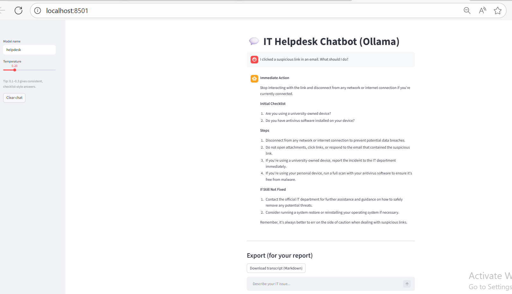

# IT Helpdesk Chatbot (LLM + Ollama + Streamlit)

A lightweight **LLM-based IT help desk chatbot** that provides safe, checklist-style troubleshooting guidance for common IT issues (email, Wi-Fi, printers, VPN, account access, security incidents).  
Built with **local LLM inference** using :contentReference[oaicite:0]{index=0} and a clean web UI using :contentReference[oaicite:1]{index=1}.

> ✅ Designed for enterprise-style usage: consistent responses, safety constraints (no passwords/MFA), and escalation guidance.

---

## Demo Screenshots

**Home / Export View**


**Example Response (Security Incident: suspicious link)**


---

## Key Features

- **Helpdesk persona via system prompt (Modelfile)**
  - Never asks for passwords or MFA codes
  - Asks only 1–2 clarifying questions max
  - Provides: *Quick diagnosis → Steps → If still not fixed (escalation)*
- **Stable “checklist-style” answers**
  - Default temperature tuned for consistency (`0.2`)
- **Local, privacy-friendly execution**
  - Runs on your machine (no external API keys required)
- **Evidence & evaluation-friendly**
  - Automated test runner generates:
    - `outputs/test_outputs.md`
    - `outputs/test_outputs.jsonl`
    - `outputs/eval_template.csv`

---

## Tech Stack

- **LLM Runtime:** :contentReference[oaicite:2]{index=2}
- **Model:** :contentReference[oaicite:3]{index=3} (`llama3:8b`)
- **UI:** :contentReference[oaicite:4]{index=4}
- **Language:** Python 3.x

---

## Project Structure

```txt
.
├── app.py                  # Streamlit chat UI
├── Helpdesk.Modelfile       # System prompt + parameters
├── run_tests.py             # Runs 5–8 IT prompts and saves outputs
├── chat_client.py           # Optional CLI client
├── requirements.txt
├── outputs/                 # Generated test outputs (ignored or committed based on preference)
└── assets/                  # Screenshots for README
````

---

## Getting Started (Windows)

### 1) Install Ollama

Download and install Ollama (Windows). Then open PowerShell and verify:

```powershell
ollama --version
```

> If `ollama` is not recognized, you may need to restart the terminal or add it to PATH.

---

### 2) Pull the base model

```powershell
ollama pull llama3:8b
```

---

### 3) Create the custom helpdesk model

From the project folder (where `Helpdesk.Modelfile` exists):

```powershell
ollama create helpdesk -f Helpdesk.Modelfile
```

Verify:

```powershell
ollama list
```

---

### 4) Run the web app

Install Python dependencies:

```powershell
pip install -r requirements.txt
```

Start the UI:

```powershell
streamlit run app.py
```

Open:

* [http://localhost:8501](http://localhost:8501)

---

## Usage

### Chat in the UI

Try prompts like:

* “My email isn’t sending. It stays in Outbox.”
* “Wi-Fi connects but the internet doesn’t work.”
* “Printer shows offline and won’t print.”
* “I clicked a suspicious link in an email. What should I do?”

### Export the conversation

Use the **Download transcript (Markdown)** button in the UI to save results for reports.

---

## Evaluation / Testing (5–8 prompts)

Run:

```powershell
python run_tests.py
```

It generates:

* `outputs/test_outputs.md` (easy to paste into reports)
* `outputs/test_outputs.jsonl` (structured logging)
* `outputs/eval_template.csv` (manual scoring: clarity/accuracy/safety)

---

## Safety Notes (Enterprise-Ready Behavior)

This chatbot is designed to:

* Avoid requesting **passwords** / **MFA codes**
* Encourage escalation for security incidents (phishing/malware)
* Prefer least-risk steps first (basic checks before advanced actions)

> ⚠️ This is not a replacement for official IT/security teams—use escalation paths where appropriate.

---
<!--
## Improvements / Roadmap

* Add **RAG** (Retrieval-Augmented Generation) using official IT knowledge base articles
* Add confidence scoring + auto-escalation triggers
* Add analytics dashboard for failure patterns and response quality monitoring
* Integrate ticket creation (ServiceNow/Jira/email) for enterprise workflows

---
-->

## Author

Md Abdullahil Oaphy

---
